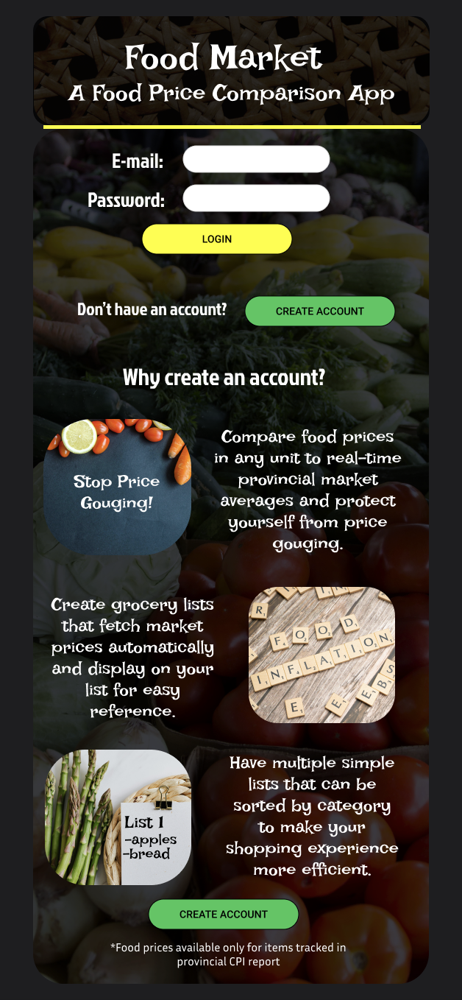
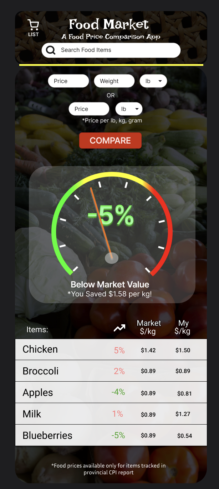
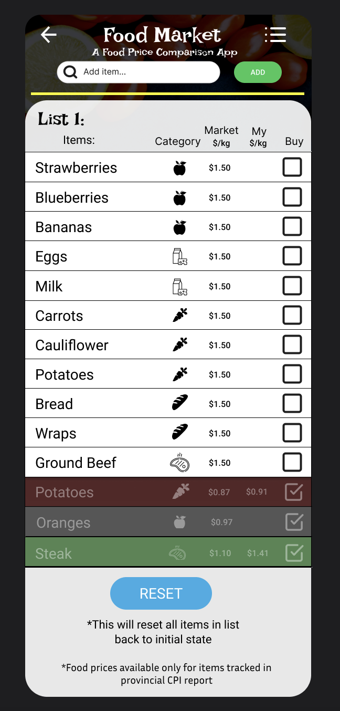
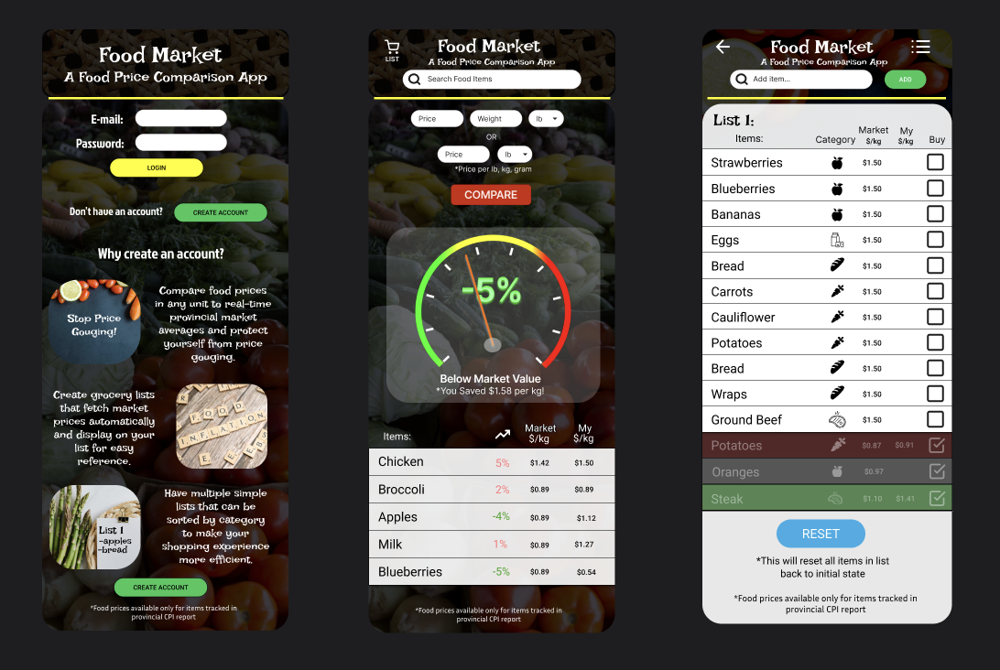
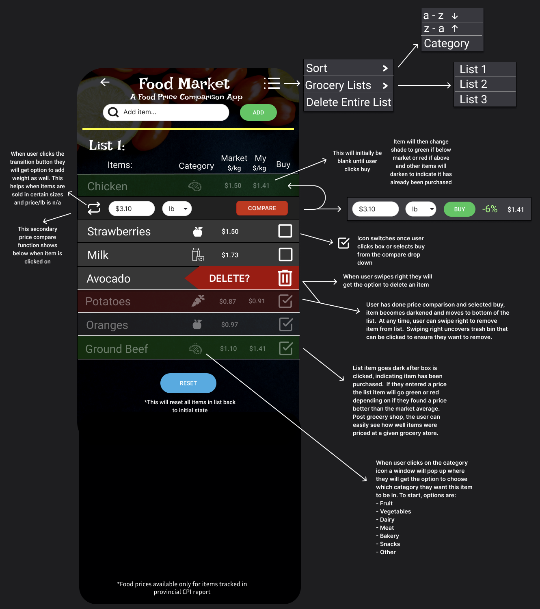
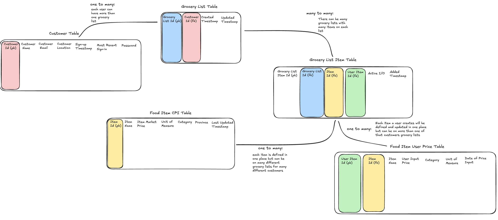

# Food Market - A Food Price Comparison App

## Kyle Ingham

## Overview

Food Market is a grocery store item price comparison app. It allows users to compare the price of selected items to the current market average price in their province. They can also see that items price over certain time frames and compare one items price to another while shopping. Users can also create an intereactive shopping list that will show each items market average price and whether or not the produce items on the list are.

### Problem Space

We are currently in a cost of living crisis as evidenced by CPI and reports from nearly every major publication in North America. Customers more than ever need to understand how much they should be paying for their groceries. This app allows users a quick and effective way to know when items are priced reasonably and when stores may be trying to gouge them.

Shopping is a necessary part of life and takes up a lot of time. Grocery stores are large and items are grouped into different sections of that store but generic list tools do not organize items by category. Also, prices flutuate and often refererence different weight units so it is difficult for people to make decisions quickly at a store. By providing an app that allows users to make lists, easily reference market prices and have the list items organized by category, users can be more efficient when they shop.

### User Profile

This app is for all people who do their own grocery shopping, want to save money and know if they are getting ripped off. They can use it by creating a grocery list that will show market average prices in their area. When they are looking at flyers, shopping online or at the grocey store they will have a quick and easy reference point to see what items should cost.

Often, expecially in Canada, items will be priced in pounds or kilograms. The app will have a separate comparison page where they can type in the price in either lbs, kgs or grams to quickly convert prices to a standard unit and compare similar items.

Not all items are tracked in CPI reports so the app will log prices of items when the user does comparisons or purchases an item. This will allow users who like to save money to build a profile of prices that are uniqe to them and representative of prices in their local area.

This app will likely be used in stores when people are in a rush. Buttons and text must be large and have good contrast so users can quickly see what they need and effectively use the app while walking around a store.

### User Story:

As a frequent grocery shopper, I often find it challenging to determine whether I'm getting a fair price on the items I purchase, especially when prices fluctuate, inflation is varialbe and items are listed in different weight units. To address these challenges, I would love to have an app that helps me make informed decisions while shopping.

### App Features:

##### Create a Grocery List:

The app allows me to easily create a grocery list by adding items I need to purchase. For each item, the app automatically fetches the current average price for that item in my province, so I have an idea of what to expect to pay when I go shopping. These items can be sorted alphabetically or by category which makes it easy to see what items I need to buy in each area of the store.

##### Market Price Indicator:

On the price comparison page, there is an input box to search a new item with its price and an odometer-style indicator that shows how the current price at my store compares to the average market price. This feature allows me to see at a glance if an item is overpriced or underpriced, helping me avoid price gouging.

##### Quick Unit Conversion:

In Canada, grocery items are often priced using different weight units, such as pounds (lbs) and kilograms (kgs). The app makes it simple to compare these items by providing a quick conversion feature. If I click on any item, I can type in the price, and the app will instantly convert it to a standard unit price in kilograms and show the percentage difference from the market average price. This conversion helps me quickly and accurately compare items, regardless of the confusing unit prices.

##### Price History and Recent Searches

The app saves the last five items I searched, showing the prices I entered and the converted standard unit price. That way if I am comparing two similar items I can quickly see which one is priced better, saving me time and money.

##### My Price:

Whenever I compare and purchase an item from my grocery list, it saves the price I paid so I always have a running average of what I pay for any given item. This allows me to easily track prices on items at my local grocery store and see when things 'really' go on sale. Also, not every item is tracked in CPI reports, so over time I can generate my own average prices for more unique items that are specific to me.

##### User-Friendly Interface:

The app features an intuitive and user-friendly interface, designed to make the shopping experience more efficient and less stressful. With its clear visuals, easy-to-read text and indicators, and seamless navigation, I can focus on finding the best deals without being overwhelmed by complex calculations.

##### Summary:

With this app, grocery shopping becomes a much more manageable task. I can create my list, get an idea of fair prices, easily compare items regardless of their listed unit, and track my past searches. All these features combined help me make smarter, more economical decisions while shopping, ensuring I never overpay for the items I need.

## Implementation

To build the Food Market app, I will use a modern and responsive web development approach, prioritizing a mobile-first design to ensure a seamless user experience across all devices, including smartphones, tablets, and desktops.

### Tech Stack

#### Frontend:

- React: The app will be developed using React. React’s component-based architecture will help manage the app’s various features, such as the login page, grocery list and market price/unit conversion tools. This modular approach allows for easy maintenance and scalability of the app.
- React Router: This library will be used to handle client-side routing, ensuring smooth navigation between different pages within the app without reloading the browser.
- Axios: Axios will be used to handle HTTP requests to the Stats Canada API. It provides a simple and efficient way to fetch and post data.

#### Backend:

- Express.js: An Express server will handle backend operations, including serving the web app and acting as an intermediary between the app and the Stats Canada API. This will allow for custom processing of data before it is sent to the frontend.
- Node.js: Node will help me connect the server to my database. Allowing me to access data about all products and provide real time pricing to users.

#### API Integration:

- Stats Canada API: The app will integrate with the Stats Canada API to fetch real-time market average prices for grocery items. This API provides up-to-date information but is limited to 25 API calls per second. Given CPI reports come out monthly, I would like to access all data once a month and store it in my database in the 'Food Item' table. This way even if my App starts getting used by thousands of people I will not worry about making too many API calls to Stats Canada. If the Stats Canada API is unavailable, alternative methods will be explored, such as manually updating the data in a database.

#### Styling and User Interface:

- I will implement CSS with a focus on responsive design principles to ensure the app looks and functions well on all device types. I will ensure that all buttons and text are large with high contrast, adhering to accessibility standards for easy use in grocery stores.

### APIs

Stats Canada API: This external data source will provide real-time market average prices for grocery items across different provinces in Canada. The API will be queried to fetch the latest data, ensuring the app remains accurate and useful to users.

### Sitemap

1. Login Page

   - This will be the landing page for users who do not have an account or are not logged into the app. It will feature the login form on top with relevant information about the app below. This will double as the product marketing page that gives potential customers more information about what the app does.

   

2. Price Comparison Page / Home Page

   - This will be the landing page for logged in users. It allows users a quick tool to check the price of any grocery store item that is tracked by Stats Canada. It will also hold data from the last 5 searched items to make for easy comparison of multiple items.

   

3. Grocery List Page

   - A page where users can create and manage their grocery lists. It will display each item's market average price and allow sorting based on category or alphabetically.

   

### Mockups

#### Design



#### Features



### Data



##### Customer Table - Includes all information about the customer:

    - Customer ID (primary key)
    - Name
    - Email
    - Location
    - Password
    - Sign-up Timestamp
    - Most recent sign-in

##### Grocery List Table - Table that links the customer to their grocery lists as each user can have many lists:

    - Grocery List ID (primary key)
    - Customer ID (foreign key)
    - Created Timestamp (when grocery list was created)
    - Updated Timestamp (when grocery list was updated)

##### Grocery List Item Table - This table will hold each item that is in any grocery list and hold the average of the users price inputs.

    - Grocery List Item Id (primary key)
    - Grocery List Id (foreign key)
    - Item Id (foreign key)
    - User Item Id (foreign key)
    - Active I/O
    - Added Timestamp

##### Food Item CPI Table - This table will hold the price of all items from all provinces

    - Item Id (primary key)
    - Item Name
    - Item Market Price
    - Unit of Measure
    - Category
    - Province
    - Last Updated Timestamp

##### Food Item User Price Table - This table will hold all prices a user logs for any given item

    - User Item Id (primary key)
    - Item Id (foreign key) - (will be used to store item id if that item exists in the CPI database)
    - Item Name
    - User Input Price
    - Category
    - Unit of Measure
    - Date of Price Input

    ***Please note that data from the last 5 searches will be stored locally as an array in a variable as I do not need that data to persist from session-to-session or across different devices.

### Endpoints

##### Stats Canada API

1.  POST: Will use a POST request to the following url. (Stats Canada requires a POST request, not a GET request to get data from a table). This request will get an array of all provinces and food items.

    - POST: https://www150.statcan.gc.ca/t1/wds/rest/getCubeMetadata
    - In the body of the request I will use the following ID:
    - [{"productId":18100245}]
    - Response:
    - ````{
      "memberId": 1,
      "parentMemberId": 11,
      "memberNameEn": "Newfoundland and Labrador",
      "memberNameFr": "Terre-Neuve-et-Labrador",
      "classificationCode": "10",
      "classificationTypeCode": "1",
      "geoLevel": 2,
      "vintage": 2016,
      "terminated": 0,
      "memberUomCode": null
      }, ```
      ````
    - Also included in the same list is each food item:
    - ````{
      "memberId": 8,
      "parentMemberId": null,
      "memberNameEn": "Chicken breasts, per kilogram",
      "memberNameFr": "Poitrines de poulet, par kilogramme",
      "classificationCode": null,
      "classificationTypeCode": null,
      "geoLevel": null,
      "vintage": null,
      "terminated": 0,
      "memberUomCode": 81
      }```
      ````

2.  POST: There is a member ID for each province/food item that populates in this request. That information is used to get specific data from each province and item. This will be used to send a more specific POST request.

    - https://www150.statcan.gc.ca/t1/wds/rest/getDataFromCubePidCoordAndLatestNPeriods
    - in the body of the request:
    - ````[
      {
      "productId": 18100245,
      "coordinate": "6.74.0.0.0.0.0.0.0.0",
      "latestN": 2
      }
      ]```
      ````

    1. Product Id: table in stats canada database where information for food prices by province is stored
    2. coordinate:
       - first position is the province ID
       - second position is the food item ID
       - Those are the only two relevant coordinates for the data I need
    3. LatestN: This is for how many periods (months) you want to get the data starting at the most recent period. Setting to two will get us the most recent month of reported CPI data and the previous month.

       - request response:
       - ````[
         {
         "status": "SUCCESS",
         "object": {
         "responseStatusCode": 0,
         "productId": 18100245,
         "coordinate": "6.74.0.0.0.0.0.0.0.0",
         "vectorId": 1353834565,
         "vectorDataPoint": [
         {
         "refPer": "2024-06-01",
         "refPer2": "",
         "refPerRaw": "2024-06-01",
         "refPerRaw2": "",
         "value": 3.61,
         "decimals": 2,
         "scalarFactorCode": 0,
         "symbolCode": 0,
         "statusCode": 0,
         "securityLevelCode": 0,
         "releaseTime": "2024-08-07T08:30",
         "frequencyCode": 6
         },
         {
         "refPer": "2024-07-01",
         "refPer2": "",
         "refPerRaw": "2024-07-01",
         "refPerRaw2": "",
         "value": 3.74,
         "decimals": 2,
         "scalarFactorCode": 0,
         "symbolCode": 0,
         "statusCode": 0,
         "securityLevelCode": 0,
         "releaseTime": "2024-09-04T08:30",
         "frequencyCode": 6
         }
         ]
         }
         }
         ]```
         ````

3.  Resulting Data:
    - In this repsonse the "value" is the price of the item in the given province
    - The "refPer" is the month it was reported

##### Local Database

1. POST: Once a month I will make a call to the Stats Canada API to get all data and use a POST request to initailly populate the Food Item CPI table on my server with most recent months data.
2. PATCH: After inital data is loaded in I will need to amend my post request to a PATCH request as I will then be updating this data. I will keep the POST request route as there may be CPI items added in future reports.
3. POST: When a user makes a list it will need to be added to the Grocery List table
4. POST: When a user adds an item to a list it will need to be added to the Grocery List Item table
5. GET: After an item is added there must be a get request to fetch the market price of that item.
6. GET: When A user uses the compare page and submits an item there must be a get request to get the monthly market price of that item
7. GET: There will need to be a get request to get ALL food items by name. This will be used in conjunction with the search input on the price compare page to check if we have CPI price data on that item. This could run once a year and store all data in an object as items don't get added or removed very often. (I will likely need to add variations of a name such as potato & potatoes to make sure search is accurate and easy to use.)
8. POST: When user uses the compare function within the grocery list and clicks buy on an item it will create another instance of that items price and POST it to the Food Item User Price table. (Note: Over time a user will have their own price averages for items that are not included in the CPI report. This should be denoted by a different text color in the list so the user knows when it is the CPI market average being shown vs. their own average price of an item.)
9. DELETE: When user removes an item from their grocery list it will be deleted from the Grocery List Item Table.
10. DELETE: When a user removes a list in must be removed from the Grocery List Table.

## Roadmap

### Sprint 1

- Set up project repository and development environment.
- Create initial wireframes/mockups for the core pages (Login Page, Price Comparison Page, Grocery List Page).
- Set up the backend server with Express and connect it to the Stats Canada API.
- Write price data from the Stats Canada API to an SQL database once a month to store prices for each province.
- Implement client-side routing using React Router for navigation between pages.
- Develop React components for the Login Page, Price Comparison Page, and Grocery List Page.
- Create forms for adding/comparing items on the Price Comparison Page and Grocery List Page.
- Apply basic styling and layout structure to each of these pages.

### Sprint 2

- Integrate Axios for API calls to fetch data from the server.
- **Price Comparison Page:**
  - Develop API endpoints for fetching item data.
  - Handle unit conversions to compare prices in different units.
  - Store user search data for price comparisons.
- **Grocery List Page:**
  - Develop API endpoints for storing and deleting list items.
  - Develop endpoints for storing unique items that do not have price data from the CPI.
  - Add a click handler on the "Buy" button that sends a PUT request to add another price point for a given item.
- Use JavaScript functionality to compare user searches and grocery list items against price data.
- Implement list sorting for the grocery list (e.g., alphabetically or by category).
- Enable user login functionality to allow saving and storing the grocery list across sessions.

### Sprint 3

- Integrate Capacitor to enable mobile app functionality.
- Conduct testing across devices to identify and resolve bugs.
- Fix all identified bugs.
- Deploy the application to the chosen platform (e.g., Netlify for frontend, Heroku for backend).

---

## Future Implementations

- Local Average Prices: Incorporate prices a user finds for items that are included in the CPI report. At first I will just display user found prices for items that don't exist in the CPI data but over time I want to give the user the option to see the CPI price as well as an average of their own logged prices on an item that is included in the CPI.
- Capacitor Integration: To ensure the app is usable on mobile devices as a standalone application, I will employ Capacitor, a cross-platform framework that allows me to convert my web app into a mobile app for iOS and Android. This integration will provide native functionalities such as offline access and push notifications.
- Seasonal Availability: Find out what produce is in season in each province and add a check to any item that is in season.
- Food price charting: Create functionality to show chart of the last 12 months of that items price when it is chosen on the item compare page.
- Implement User Preferences: Develop a system for users to customize their app experience. Include options for default units of measurement, preferred sorting methods for lists, price alert thresholds, and display settings (e.g., dark mode). Store these preferences in a flexible key-value pair structure in the database, allowing for easy addition of new preference types as the app evolves.
- Multiple users on one account: Allow multiple users on one account to have access to a single list so that no matter who shops it is easy to see what has already been bought.
- User dashboard: Create dashboard for user that includes commonly shopped items and relevant data on those items. User can also save items that they find a good price on and input where and when they found this price so the user can easily see where they have found good prices on regularly purchased items.
- Price tag scanner: Embed a price tag scanner that can pull the price, item and unit of measurement from any price tag in a major grocery store. Will consider open source OCR's like tesserect or other options
